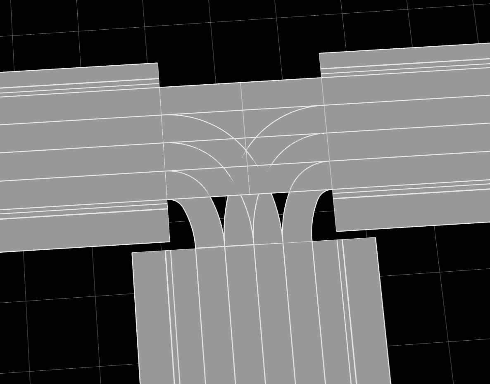

## OpenDrive地图解析

### 1. 功能支持

* 解析并可视化OpenDrive地图文件中的车道线
  * 包含颜色、实虚线、宽度等信息
  * 支持以线段-两点格式输出结果
* 解析并可视化OpenDrive地图文件中的可行驶区域

### 2. 库用法

* 依赖库：`pip install tqdm easydict matplotlib numpy opencv-python`
* 示例Python代码如下：
```python
from OpenDriveLibrary import MapParser

# 基础用法
xodr_file_path = 'path/to/your/xodr/file.xodr'
map_parser = MapParser(xodr_file_path)

# 可视化
map_parser.visualize()
```

* 测试代码：

```text
python xodr_main.py [-h] [-x XODR]

xodr解析库用法与测试

optional arguments:
  -h, --help            show this help message and exit
  -x XODR, --xodr XODR  xodr文件绝对路径

------------------ 示例用法 ---------------------

# 解析并可视化指定OpenDrive地图文件
python xodr_main.py --xodr_file_path path/to/your/xodr/file.xodr
```
### 3.可行驶区域scope & 车道线分段segs
主要流程
1. 解析xodr文件，初始化各采样点坐标；
2. 设置自车信息，包括xyz坐标、hdg自车朝向弧度(正数顺时针负数逆时针)、scope半径（米）、theta曲线分段夹角弧度阈值、z_lim高程上加下减阈值（米）和quality放缩系数。
quality所表达的意义如下，原始地图坐标个位数单位为米，则小数点后1位为分米，以此类推，那么蒙版每移动1像素所代表的距离单位为
（quality*原始地图坐标）的个位数所代表的单位。其中，scope半径默认为50，theta默认为0.05（约0.3度），z_lim默认为5（国内某一市极限坡度12%），quality默认为1e2；
3. 进行scope内的车道线分段，同时记录出现在scope内（包括高程范围内）的道路。对于junction道路，需要车道坐标在xy平面上包含于scope，
且z方向上在（自车z坐标±z_lim）内。对于非junction道路，需要车道线坐标在xy平面上包含于scope，且z方向上在（自车z坐标±z_lim）内。注意，车道线分段结果给出的端点坐标以自车坐标为原点；
4. 进行scope地图初始化，创建全图长宽±1.5倍scope半径尺寸的画布，以1.5倍scope半径偏移坐标绘制上一步记录的在scope内出现过的道路；
5. 在上一步所绘地图上取scope方框的边分别平行于xy轴的外接矩形（由于车头朝向），二值化后进行旋转（使车头朝向向上）和贴合scope框的裁剪，将值为255的像素点置为1。

如果需要查看蒙版图片，需要在OpenDriveLibrary/__init__.py中对204行取消注释

* ~~问题1 已解决~~
* 问题2 部分测试文件中（03、06）存在超短车道（<0.1m）或空车道

* ~~问题3 中间有不可行驶区域（实际可行驶）是否需要填充~~



### 4.scope & segs调用方法
目前强制按照以下顺序
```text
map_parser = MapParser(xodr_file_path)

map_parser.car_init(车xyz坐标(tuple or list),
                    车hdg(rad),
                    scope半径(m),
                    车道线分段弧度阈值(rad)，
                    z向阈值(向上加且向下减)，
                    在原本的坐标上放大的倍数)
          默认值car_coords=(0.0,0.0,0.0), car_hdg=0.0, 
               scope_r=50.0, theta=0.05, z_lim=5, quality=1e2
# 每次车的位置改变都需要调用该函数更新


seg_res, seg_types, seg_colors = map_parser.get_segs()
map_parser.scopemap_init()
seg_res, scope_res = map_parser.get_scope(segs=seg_res,step=step)
# 以上为增加了记录项目之后的参数情况，除了可行驶区域和车道线分段外，还需要记录车道线颜色和类型

###### 以下注释仅供对应名称函数的时间和shape参考 ######
# seg_res=map_parser.get_segs()  
# numpy array 
# town05参考time: 0.6s shape: one list of n(roads)*m(lanes)*mp(points)*2 (不均匀array，dtype=object)

# map_parser.scopemap_init() 
# town05参考time：2s

# scope_res=map_parser.get_scope(可选参数 scale=(长像素值，宽像素值)
#                                      表示插值到所需尺寸)  
# numpy array
# town05参考time: 0.64s len=2*scope半径*quality, shape: len*len

# 每当车的位置改变获取蒙版都需要进行以上get_segs, scopemap_init和get_scope步骤
# 只获取车道线分段仅需get_segs

###### 可视化调用函数 ######
map_parser.visualize_elevation()
# 查看带高程信息的地图
map_parser.visualize()
# 查看带道路信息的2d地图
```